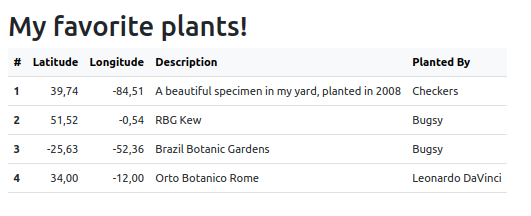

# Html from using XSLT JQuery


## format-number

```xml
<xsl:decimal-format decimal-separator="," grouping-separator=" " name="my-format" />
<xsl:template match="/">
[...]
<td align="right">
   <xsl:value-of select="format-number(price, '# ##0,00', 'my-format')"/>
```

## auto-number row

position()  
```xsl
<xsl:for-each select="//specimen">
   <tr>
      <th scope="row">
            <xsl:value-of select="position()" />
      </th>
```

---

## Bootstrap 

1. Download [bootstrap v5.3.0](https://cdn.jsdelivr.net/npm/bootstrap@4.0.0/dist/css/bootstrap.min.css)  
```html
<link rel="stylesheet" href="css/bootstrap.min.css" >
```

1. Table 

`table-hover` : Hoverable rows in tbody  
`w-auto` : automatic width (instead of 100%)
`table-light` or `table-dark`: thead  
`<th scope="row"` : row header  
```html
<table class="table table-hover w-auto">
   <thead class="table-light">
         <tr>
            <th scope="col"></th>
         </tr>
   </thead>
   <tbody>
      <tr>
         <th scope="row"></th>
         <td></td>
      </tr>
   </tbody>
   </table>

```
---  
## jquery 

1. Download [jquery v3.7.1](https://cdnjs.cloudflare.com/ajax/libs/jquery/3.7.1/jquery.min.js
)

```html
<script src="js/jquery.min.js"></script>
```

```javascript
[...]
<script>
	$.when(
		$.get('data.xml'), 
		$.get('style.xsl'))
	.done(function(xml, xsl){
		const processor = new XSLTProcessor()
		processor.importStylesheet(xsl[0])
		const fragment = processor.transformToFragment(xml[0], document)
		$('#container').html(fragment)
	})
  </script>
  </body>
```
